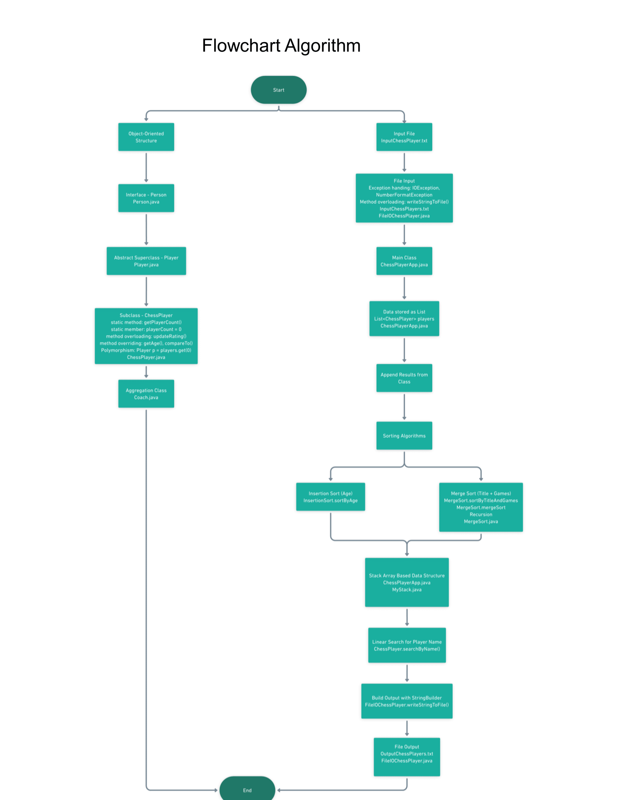

# Chess Player Project

A Java project that processes chess player data using data structures and algorithms to analyze and manage player information from an input file.

- **File I/O:** Reads and writes chess player data from a `.txt` input file.
- **Exception Handling:** Uses custom and built-in exception handling for robust input validation.
- **Object-Oriented Programming:** Includes a superclass, subclass, interface, method overloading, method overriding, static members/methods, polymorphism, and aggregation.
- **Data Structures & Algorithms:**
  - Stack for data management
  - Insertion sort and Merge sort for organizing player data
  - Recursive methods (Merge Sort)
  - Searching using linear search
- **Flowchart:** A visual representation of program logic is included to explain data processing and algorithm flow.
  - 
    
## Installation
1. Clone this repo: `git clone ...`
2. Open in NetBeans
3. Run the `Main.java` file

